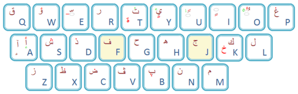
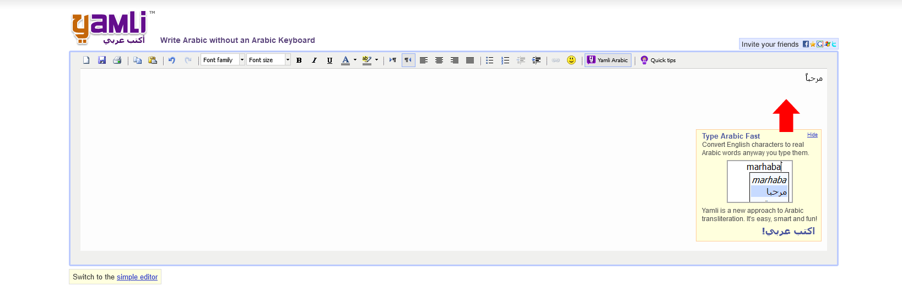
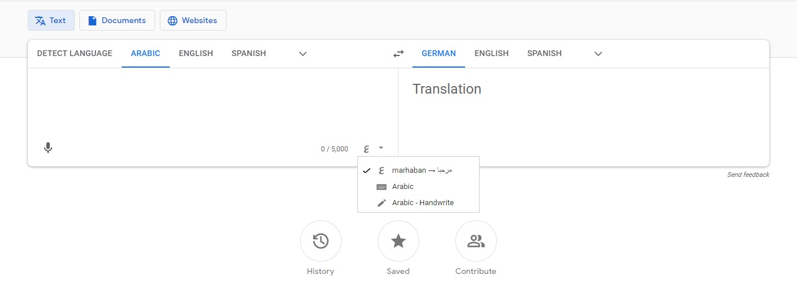

# User Guide

This is a short guide on how to use the tool. 

## What does the tool do

This program lets you convert between a Latin transliteration of Arabic and Arabic itself. 
Just start typing and try it out. 

## Additional Notices

1. If you see suggestions for clarification showing up at the bottom of the screen only choose one of them **after** you have finished writing completely. 

## Unexpected Behaviour/Errors

If you encounter unexpected behaviour, please feel free to file an issue in the github repo

## Transliteration Notice

What normal person has a keyboard that can easily produce these? 
. ǧ (`ج`)
. ḥ (`ح`)
. ẗ (`ة`) 
However, these are from the common standards that I just found on wikipedia. 

In general, the transliteration I am using can easily be written with any english/latin keyboard. 
It is partially inspired by the transliteration in Duolingo.  
That in turn seems to be inspired by 
[ALA-LC romanization](https://en.wikipedia.org/wiki/ALA-LC_romanization)/
[ALA-LC-Transkription](https://en.wikipedia.org/wiki/ALA-LC-Transkription) and also Qalam ([Source](https://en.wikipedia.org/wiki/Romanization#Arabic))

Most letters are chosen depending on how they sound: `b->ب`  
Emphatic letters are capitalized: `H->ح` (we can do this because Arabic doesn't know capital letters)  
This is so that the reading flow is very simple. 
Some characters are chosen depending on how they look like:  
`2->ء`,  
`3->ع`,  
`ä,ö->ة` (This is more of a hack. I included it just because of the similar look)  
Also, some letters are ambigous: `ج` can be described as `g` or `j`  
or the transliteration depends on the context: `a` can either be an `ا` if it stands alone  
or, following a letter, it becomes a fatHa: `ba -> بَ`  

But really the transliteration is very simple and especially intuitive.  
So, you should be able to do most stuff without looking it up.  
If you don't know how to express something then swap Latin and Arabic 
and get the Latin result for your Arabic text from the computer.  
If you need to split two letters like `t` and `h`, use an underscore `t_h`

## Special characters

1. The `sukuun` will not be added automatically. Instead, if you want to force a sukuun then add an o after the letter: `lo` -> `لْ`. 
2. The Alif maksura can be written as `-_`. If you have a different suggestion, tell me.
3. The hamza is presented as a `2` as stated above, however a hamza can also be mounted on to a normally long vowel:
  . `أ` is a `'`
  . `ئ` is `y'`
  . `ؤ` is `w'`
4. Numbers will automatically be detected but if you want a single hamza or 3ayn prefix it with `_`. Like so:
  `_3 3 -> ع ٣`
5. `ٱ`. Use an Alif followed by a sukun eg: `ao`
6. The `ta marbuta` is written as an h with two dots ~~on top~~ at the side: `h:` -> `ة`

## Alternatives

### An arabic keyboard
You can either buy a physical arabic keyboard or use a digital keyboard

### Handwriting recognition
Some online tools can turn handwritten text to digital text.

### Similar transliteration tools
A good example is [Yamli](https://www.yamli.com/arabic-keyboard/)

### Google Translate
[Google Translate](https://translate.google.de/?sl=ar&tl=en&op=translate) supports any of the above and as a special side gift it also translates your text.

## Known Issues
1. Some l10n issues in German mode with the languages on the front page (they stay English)
2. At least on web (and maybe also on phones) saving and loading doesn't work properly.
  - The save naming is `language_name` but it should be `language_name`.txt
  - Web upload doesn't work properly
3. Also PDF doesn't work yet because of the font. We could for example use Arial instead of Lateef (any font without opentype features will work) (suggestions welcome)
